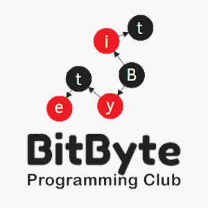

    

<h1 align="center"> 
    BitByte - The Programming Club
     
    Beginners-Byte 🎉
</h1>

### This repository contains a curated list of awesome beginner-friendly projects :tada: and issue labels where you can easily contribute and get a head start into your journey of Open Source. :rocket:

If you are in search of some good beginner-friendly issues irrespective of the project, head up to [first-timers-only](https://github.com/search?q=label%3Afirst-timers-only+is%3Aissue+is%3Aopen&type=Issues) where you can find all the issues with `first-timer-only` label across all repositories on GitHub.

---

## Projects

- [10-Easy-Steps](https://github.com/msandfor/10-Easy-Steps)  
  A Repository Created for #Hacktoberfest to Help Beginners Get Started with Code  
   
- [algo_ds_101](https://github.com/ahampriyanshu/algo_ds_101)  
  An algorithm a day keeps the mass recruiter away  
      
- [AlgoCode](https://github.com/pratik-choudhari/AlgoCode)  
  Here you can solve problems, build bots and much more.  
     
- [All_Programs_and_algorithms](https://github.com/jeremie1112/All_Programs_and_algorithms)  
  In this repository, you can add all your programs and algorithm using any coding languages  
        
- [Automation-scripts](https://github.com/python-geeks/Automation-scripts)  
  Repo for creating awesome automation scripts to make my panda lazier  
      
- [awesome-hacktoberfest-2020](https://github.com/OtacilioN/awesome-hacktoberfest-2020)  
  A curated list of awesome Hacktoberfest 2020 repositories, guides and resources  
   
- [awesome-php](https://github.com/ziadoz/awesome-php)  
  A curated list of amazingly awesome PHP libraries, resources and shiny things.  
   
- [Awesome-Profile-README-templates](https://github.com/kautukkundan/Awesome-Profile-README-templates)  
  A collection of awesome readme templates to display on your profile  
   
- [awesome-python](https://github.com/vinta/awesome-python)  
  A curated list of awesome Python frameworks, libraries, software and resources  
   
- [awesome-travel](https://github.com/unseen1980/awesome-travel)  
  Do you want to build a travel app?  
        
- [beginners-byte](https://github.com/BitByte-TPC/beginners-byte)  
  List of awesome beginner-friendly projects  
     
- [Coding-Questions](https://github.com/soh-sarkar/Coding-Questions)  
  This Repository will house the competitive coding and interview questions.  
      
- [dev-resume](https://github.com/Taiwrash/dev-resume)  
  Dev resume is an open source project where all developer around showcase their contributions to open source. Dev resume is a simple to contribute project  
     
- [developer-community-stats](https://github.com/subeshb1/developer-community-stats)  
  A repository to encourage beginners to contribute to open source and for all contributors to view their Github stats  
        
- [devsnippets](https://github.com/rickwest/devsnippets)  
  A collection of useful code snippets for new developers  
      
- [first-bit](https://github.com/BitByte-TPC/first-bit)  
  Contribute your first bit to Open Source.  
      
- [git-osp-for-beginners](https://github.com/aditya109/git-osp-for-beginners)  
  A GitHub Repository to encourage and involve beginners in Open Source Contributions  
     
- [Hacktoberfest-2k20](https://github.com/WebClub-NITK/Hacktoberfest-2k20)  
  Repository for Hacktoberfest 2020 Meetup at NITK Surathkal  
      
- [Hacktoberfest2020](https://github.com/CMPN-CODECELL/Hacktoberfest2020)  
  A guide to help you contribute to Hacktoberfest 2020 and to get you started towards Open Source Contribution  
     
- [JagratiWebApp](https://github.com/garg3133/JagratiWebApp)  
  Official WebApp of Jagrati - An Initiative of IIITians  
      
- [LeetCode-Solutions](https://github.com/SHY-Corp/LeetCode-Solutions)  
  A compilation of all the Leetcode solutions.  
     
- [motivate](https://github.com/avats-dev/motivate)  
  A simple script to print random motivational quotes. Highly influenced by linux command fortune.  
   
- [One_line_PythonPrograms](https://github.com/girishtulabandu/One_line_PythonPrograms)  
  This repository holds simple/complex python programs that can be written in single line.  
       
- [opendrinks](https://github.com/alfg/opendrinks)  
  Open Source Drinks! Add your own recipe in a pull request!  
   
- [predator](https://github.com/Zooz/predator)  
  A powerful open-source platform for load testing APIs.  
       
- [PRpractice](https://github.com/iamvpa/PRpractice)  
  Send your Pull Request  
   
- [ritchie-formulas](https://github.com/ZupIT/ritchie-formulas)  
  This repository contains the community formulas that can be executed through Ritchie CLI once imported.  
      
- [Seasonal Bot](https://github.com/python-discord/seasonalbot)  
  A Discord bot started as a community project for Hacktoberfest 2018, later evolved to bot that changes with the seasons.  
      
- [simple-icons](https://github.com/simple-icons/simple-icons)  
  SVG icons for popular brands  
     
- [simplejavaprogram](https://github.com/tusharjuneja06/simplejavaprogram)  
  add ur java programs as a contribution to hacktoberfest 2020  
   
- [Snippets](https://github.com/Anuja-19/Snippets)  
  Contribute to this repository and get your snippet featured on our website.  
      
- [TF-Droid](https://github.com/ROBOTICS-CLUB-IIITDMJ/TF-Droid)  
  Homeland to test your Tensorflow models using tflite  
     
